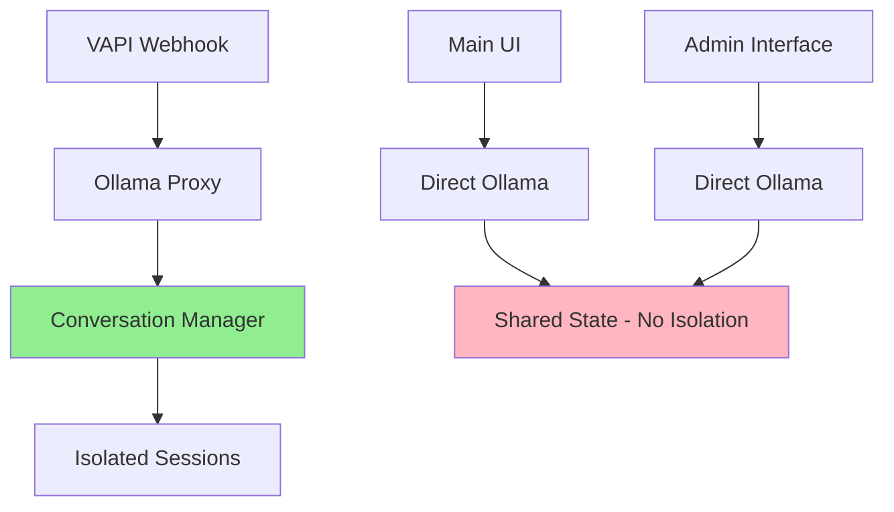
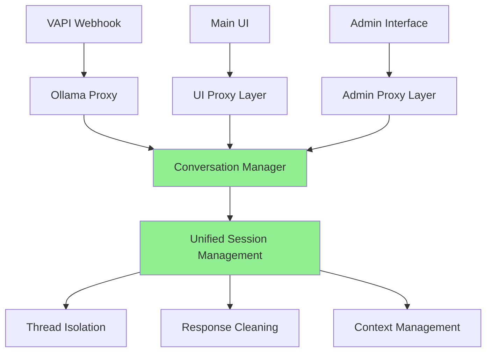

# Unified Conversation Management Plan

## Extending Conversation Manager to All Interfaces

### 🎯 **Goal:**

Create a **single conversation management system** that works across:

- **VAPI Integration** (phone calls)
- **Main UI** (web interface)
- **Admin Interface** (management panel)

---

## 🔄 **Current Architecture:**



---

## 🚀 **Target Architecture:**



---

## 🔧 **Implementation Plan:**

### **Phase 1: Create Unified Proxy Layer**

```python
# New file: src/proxy/unified_proxy.py
class UnifiedOllamaProxy:
    """Unified proxy that all interfaces use"""

    def __init__(self):
        self.conversation_manager = conversation_manager
        self.thread_manager = thread_manager
        self.response_cleaner = response_cleaner

    async def chat_completion(self, request, interface_type="ui", session_id=None):
        """Handle chat completion for any interface"""
        if not session_id:
            session_id = self._generate_session_id(interface_type)

        # Create isolated session
        self.conversation_manager.create_conversation(session_id, request.model)

        # Process through conversation manager
        return await self._process_with_isolation(request, session_id)
```

### **Phase 2: Update Main UI to Use Proxy**

```python
# In src/gui/main_ui.py or wherever your main UI is
from proxy.unified_proxy import UnifiedOllamaProxy

class MainUI:
    def __init__(self):
        self.proxy = UnifiedOllamaProxy()

    async def handle_chat(self, user_message, model_name):
        # Use unified proxy instead of direct Ollama
        response = await self.proxy.chat_completion(
            request=ChatRequest(messages=[user_message], model=model_name),
            interface_type="main_ui"
        )
        return response
```

### **Phase 3: Update Admin Interface**

```python
# In src/admin/admin_interface.py
from proxy.unified_proxy import UnifiedOllamaProxy

class AdminInterface:
    def __init__(self):
        self.proxy = UnifiedOllamaProxy()

    async def admin_chat(self, message, model_name):
        # Use unified proxy for admin conversations
        response = await self.proxy.chat_completion(
            request=ChatRequest(messages=[message], model=model_name),
            interface_type="admin"
        )
        return response
```

---

## 📋 **Files to Modify/Create:**

### **1. New: `src/proxy/unified_proxy.py`**

- Central proxy for all interfaces
- Session management integration
- Response cleaning pipeline

### **2. Update: `src/gui/main_ui.py` (or wherever your main UI is)**

- Replace direct Ollama calls with unified proxy
- Add session management

### **3. Update: `src/admin/admin_interface.py` (or wherever your admin UI is)**

- Replace direct Ollama calls with unified proxy
- Add session management

### **4. Update: `src/ollama_proxy_streaming.py`**

- Use unified proxy instead of direct conversation manager
- Maintain VAPI compatibility

---

## 🎯 **Benefits of Unified System:**

### **Consistent Behavior:**

- ✅ **Same conversation isolation** across all interfaces
- ✅ **Same response cleaning** everywhere
- ✅ **Same thread management** for all users

### **Better User Experience:**

- ✅ **No conversation corruption** in any interface
- ✅ **Clean responses** in main UI and admin
- ✅ **Professional conversations** everywhere

### **Easier Maintenance:**

- ✅ **Single codebase** for conversation logic
- ✅ **Centralized fixes** for all interfaces
- ✅ **Unified testing** and debugging

---

## 🚀 **Quick Implementation Steps:**

### **Step 1: Create Unified Proxy**

```bash
# Create the unified proxy file
mkdir -p src/proxy
touch src/proxy/__init__.py
touch src/proxy/unified_proxy.py
```

### **Step 2: Update Main UI**

```python
# Replace direct Ollama calls with:
from proxy.unified_proxy import UnifiedOllamaProxy
proxy = UnifiedOllamaProxy()
response = await proxy.chat_completion(request)
```

### **Step 3: Update Admin Interface**

```python
# Same pattern for admin interface
from proxy.unified_proxy import UnifiedOllamaProxy
proxy = UnifiedOllamaProxy()
response = await proxy.chat_completion(request)
```

---

## 🧪 **Testing Strategy:**

### **Test 1: Cross-Interface Isolation**

- Start conversation in main UI
- Start conversation in admin interface
- Verify no cross-contamination

### **Test 2: Consistent Response Quality**

- Same prompt in all interfaces
- Verify identical response cleaning
- Check for system prompt removal

### **Test 3: Session Management**

- Long conversations in each interface
- Verify context stability
- Check memory cleanup

---

## 💡 **Key Advantages:**

1. **Single Source of Truth** - All interfaces use same conversation logic
2. **Consistent Quality** - Same response cleaning everywhere
3. **Easier Debugging** - One place to fix conversation issues
4. **Better User Experience** - Professional conversations in all interfaces
5. **Future-Proof** - Easy to add new interfaces

---

## 🎯 **Next Steps:**

1. **Create unified proxy** (`src/proxy/unified_proxy.py`)
2. **Update main UI** to use unified proxy
3. **Update admin interface** to use unified proxy
4. **Test cross-interface isolation**
5. **Verify consistent behavior**

**This will give you the same high-quality conversation management across VAPI, main UI, and admin interface!** 🎉
