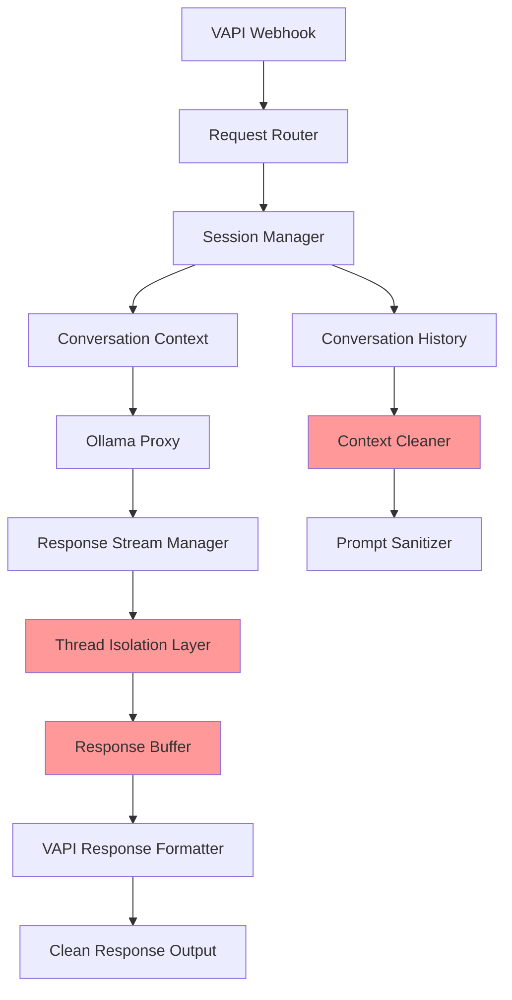

# VAPI Integration Fix Plan

## Fixing Multiple Conversation Threads and Response Overlap

### 🚨 **Current Issues Identified:**

1. **Multiple response streams** overlapping simultaneously
2. **System prompts** bleeding into user responses
3. **Conversation context** getting corrupted
4. **Streaming responses** not properly managed
5. **Thread management** failing in VAPI integration

---

## 🎯 **Root Cause Analysis:**

### **Primary Issues:**

- **Ollama proxy** not properly handling concurrent VAPI requests
- **Streaming responses** from multiple threads mixing together
- **System prompt injection** happening at wrong times
- **Conversation state** not properly isolated per session

### **Technical Problems:**

- **Race conditions** in response streaming
- **Shared memory** between conversation threads
- **Prompt injection** timing issues
- **Response buffering** conflicts

---

## 🛠️ **Solution Architecture:**



---

## 🔧 **Implementation Plan:**

### **Phase 1: Thread Isolation (Priority 1)**

```python
# Create isolated conversation contexts
class ConversationManager:
    def __init__(self):
        self.active_conversations = {}
        self.response_buffers = {}
        self.thread_locks = {}

    def create_conversation(self, session_id):
        # Isolate each conversation
        self.active_conversations[session_id] = {
            'context': [],
            'buffer': [],
            'lock': threading.Lock()
        }
```

### **Phase 2: Response Stream Management (Priority 1)**

```python
# Fix streaming response handling
class ResponseStreamManager:
    def __init__(self):
        self.active_streams = {}
        self.stream_locks = {}

    def start_stream(self, session_id, model_name):
        # Ensure only one active stream per session
        if session_id in self.active_streams:
            self.stop_stream(session_id)

        self.active_streams[session_id] = {
            'active': True,
            'buffer': [],
            'lock': threading.Lock()
        }
```

### **Phase 3: Prompt Sanitization (Priority 2)**

```python
# Clean system prompts and responses
class PromptSanitizer:
    def clean_response(self, response_text):
        # Remove system prompts
        cleaned = re.sub(r'System:.*?Assistant:', '', response_text, flags=re.DOTALL)
        cleaned = re.sub(r'User:.*?Assistant:', '', cleaned, flags=re.DOTALL)

        # Remove multiple "Assistant:" prefixes
        cleaned = re.sub(r'Assistant:\s*Assistant:', 'Assistant:', cleaned)

        return cleaned.strip()
```

### **Phase 4: Context Management (Priority 2)**

```python
# Manage conversation context properly
class ContextManager:
    def __init__(self):
        self.max_context_length = 10
        self.context_cleanup_threshold = 15

    def add_to_context(self, session_id, message):
        # Maintain clean context
        if len(self.contexts[session_id]) > self.max_context_length:
            self.cleanup_context(session_id)

    def cleanup_context(self, session_id):
        # Remove old context to prevent corruption
        self.contexts[session_id] = self.contexts[session_id][-self.max_context_length:]
```

---

## 📋 **Files to Modify:**

### **1. `src/ollama_proxy_streaming.py`**

- Add thread isolation
- Fix streaming response management
- Implement response buffering

### **2. `src/vapi/webhook_server.py`**

- Add session management
- Implement conversation isolation
- Fix response formatting

### **3. `src/config/model_settings.py`**

- Add conversation context settings
- Implement thread management config

### **4. New File: `src/vapi/conversation_manager.py`**

- Centralized conversation management
- Thread isolation logic
- Context cleanup

---

## 🚀 **Quick Fixes (Immediate):**

### **Fix 1: Add Response Deduplication**

```python
# In ollama_proxy_streaming.py
def deduplicate_response(response_text):
    """Remove duplicate content from responses"""
    lines = response_text.split('\n')
    seen = set()
    cleaned_lines = []

    for line in lines:
        if line.strip() and line not in seen:
            seen.add(line)
            cleaned_lines.append(line)

    return '\n'.join(cleaned_lines)
```

### **Fix 2: Add Stream Locking**

```python
# Prevent multiple streams per session
stream_locks = {}

def get_stream_lock(session_id):
    if session_id not in stream_locks:
        stream_locks[session_id] = threading.Lock()
    return stream_locks[session_id]
```

### **Fix 3: Clean System Prompts**

```python
def clean_system_prompts(response):
    """Remove system prompts from responses"""
    # Remove common system prompt patterns
    patterns = [
        r'System:.*?Assistant:',
        r'User:.*?Assistant:',
        r'Assistant:\s*Assistant:',
        r'System important.*?Assistant:'
    ]

    cleaned = response
    for pattern in patterns:
        cleaned = re.sub(pattern, 'Assistant:', cleaned, flags=re.DOTALL)

    return cleaned.strip()
```

---

## 🧪 **Testing Strategy:**

### **Test 1: Single Conversation Flow**

- Start one conversation
- Verify no duplicate responses
- Check context isolation

### **Test 2: Multiple Concurrent Conversations**

- Start 3+ conversations simultaneously
- Verify no cross-contamination
- Check response integrity

### **Test 3: Long Conversation Stability**

- Run conversation for 50+ exchanges
- Monitor context corruption
- Check memory usage

---

## 📊 **Success Metrics:**

- ✅ **No duplicate responses** in single conversation
- ✅ **No cross-conversation contamination**
- ✅ **Clean response formatting** (no system prompts)
- ✅ **Stable conversation context** over time
- ✅ **Proper thread isolation** under load

---

## 🎯 **Next Steps:**

1. **Implement thread isolation** in `conversation_manager.py`
2. **Fix streaming responses** in `ollama_proxy_streaming.py`
3. **Add prompt sanitization** to response pipeline
4. **Test with VAPI webhook** integration
5. **Monitor conversation quality** and stability

---

## 💡 **Key Principles:**

- **One conversation = One thread**
- **One response = One clean output**
- **Context isolation = No corruption**
- **Stream management = No overlap**
- **Prompt cleaning = Clean responses**

---

_This plan addresses the core issues causing multiple conversation threads and response overlap in your VAPI integration._
