# Pydantic Self-Correcting Validation System

**Date:** August 6, 2025  
**Status:** 🚀 FULLY IMPLEMENTED  
**Innovation:** Self-Correcting AI Responses Using Validation Errors as Training Data

---

## 🎯 **REVOLUTIONARY CONCEPT IMPLEMENTED**

### **The "Validation Error as Training Data" System**

You asked for a system where **Pydantic validation errors become the training feedback** - essentially where "the error IS the response." We've implemented exactly this:

```python
# When AI responds poorly...
try:
    validate_jamie_response_pattern(ai_response)  # This will fail
except ValidationError as e:
    # The validation failure tells us EXACTLY what's wrong
    validation_errors = e.errors()  # These become improvement suggestions

    # Then we automatically provide the CORRECT Jamie response
    corrected_response = generate_jamie_style_response(user_query, validation_errors)

    # The "error" becomes the training data for next time
```

### **How It Works in Practice**

1. **AI Responds** → Model generates response
2. **Pydantic Validates** → Checks against Jamie's actual patterns from 3,555 real conversations
3. **Validation Fails** → Error tells us exactly what's wrong (conversation simulation, system leakage, etc.)
4. **Auto-Correction** → System provides the correct Jamie-style response
5. **Learning Loop** → Validation failures become training improvements

---

## 🏗️ **SYSTEM ARCHITECTURE**

### **Core Components**

```python
# 1. Response Pattern Validation (Pydantic Models)
class JamieResponsePattern(BaseModel):
    acknowledgment: bool
    action_plan: bool
    timeline: bool
    professional_tone: bool
    contains_conversation_simulation: bool = False  # MUST be False
    contains_system_prompts: bool = False          # MUST be False

    @validator('contains_conversation_simulation')
    def no_conversation_simulation(cls, v):
        if v:
            raise ValueError('Response simulates conversation instead of single response')
        return v

# 2. Response Validator (Self-Correcting Engine)
class ResponseValidator:
    def validate_response(self, user_message: str, ai_response: str) -> ResponseValidationResult:
        try:
            # Try to validate against Jamie's patterns
            pattern = self.analyze_response_pattern(user_message, ai_response)
            return success_result
        except ValidationError as e:
            # VALIDATION ERRORS BECOME TRAINING DATA
            validation_errors = [str(error) for error in e.errors()]
            corrected_response = self._generate_corrected_response(user_message, ai_response)
            return failure_result_with_correction

# 3. Real-Time Integration (Every Response Validated)
validation_result = response_validator.validate_response(message, raw_response)
```

### **Data Sources**

- **3,555 Real Conversation Samples** from `langchain_indexed_conversations.json`
- **913 Original Conversations** across 151 client threads
- **Jamie's Actual Responses** categorized by issue type (HVAC, plumbing, payments, etc.)

---

## 🔍 **VALIDATION PATTERNS**

### **What Gets Validated**

```python
# Jamie's Response Patterns (Learned from Real Data)
✅ GOOD Response Pattern:
- Acknowledges issue: "Sorry to hear about that"
- Provides action plan: "I'm calling our contractor right now"
- Includes timeline: "They'll contact you within the hour"
- Professional tone: Empathetic but solution-focused
- Contact info when appropriate: Phone numbers, instructions

❌ BAD Response Pattern:
- Conversation simulation: "User: ... Jamie: ..."
- System prompt leakage: "Please respond as..."
- Too short: Less than 20 characters
- Too long: More than 500 characters
- Unprofessional tone: Casual language, slang
```

### **Issue Type Classification**

```python
# Automatic categorization based on keywords
issue_types = {
    "hvac": ["ac", "air condition", "heat", "cool"],
    "plumbing": ["toilet", "leak", "water", "drain"],
    "electrical": ["power", "outlet", "light"],
    "payment": ["rent", "portal", "late", "due"],
    "maintenance": ["repair", "fix", "broken"],
    "emergency": ["urgent", "asap", "flooding"]
}

urgency_levels = {
    "emergency": ["emergency", "urgent", "asap", "flooding"],
    "high": ["soon", "today", "quickly"],
    "normal": everything_else
}
```

---

## 📊 **REAL-TIME FEEDBACK LOOP**

### **Admin Dashboard Integration**

When you test a model response in `/admin`, you now see:

```html
✅ Pydantic Validation: PASSED Jamie Score: 87.3% • Category: hvac (emergency)
🔍 Expandable Sections: ├── ⚠️ Validation Errors Found (if any) ├── 💡
Improvement Suggestions ├── 👩‍💼 What Jamie Actually Said (Database) └── 📝
Corrected Response (Auto-Generated)
```

### **Example Validation Flow**

```javascript
// User tests: "My AC stopped working"
// AI responds: "User: AC issue \n Jamie: I'll help with that..."

// VALIDATION FAILS with specific errors:
❌ Validation Errors:
- "Response simulates conversation instead of single response"
- "Contains User:/Jamie: patterns"

💡 Improvement Suggestions:
- "Remove conversation simulation - respond as Jamie directly"
- "Add timeline expectations (e.g., 'within the hour')"

👩‍💼 What Jamie Actually Said:
"I understand this is urgent. I'm calling our HVAC contractor right now to get someone out there today."

📝 Corrected Response:
"I understand this is urgent, especially with the weather. I'm calling our HVAC contractor right now to get someone out there today. They should contact you within the next hour to schedule an appointment."
```

---

## 🎯 **VALIDATION METRICS**

### **Jamie Score Calculation**

```python
def calculate_jamie_score(pattern, similarity_score):
    # Base score from similarity to actual Jamie responses
    base_score = similarity_score * 0.6

    # Pattern compliance score
    pattern_score = 0
    if pattern.acknowledgment: pattern_score += 0.15
    if pattern.action_plan: pattern_score += 0.20
    if pattern.timeline: pattern_score += 0.15
    if pattern.professional_tone: pattern_score += 0.10

    # Penalties for bad patterns
    if pattern.contains_conversation_simulation: pattern_score -= 0.30
    if pattern.contains_system_prompts: pattern_score -= 0.25

    return base_score + (pattern_score * 0.4)
```

### **Success Criteria**

- **Jamie Score ≥ 70%** = Response passes validation
- **Jamie Score < 70%** = Validation fails, correction provided
- **Similarity Score** = Semantic similarity to real Jamie responses
- **Issue Classification** = Automatic categorization for targeted feedback

---

## 🔄 **CONTINUOUS IMPROVEMENT CYCLE**

### **The Self-Correcting Loop**

```mermaid
graph TD
    A[User Query] --> B[AI Generates Response]
    B --> C[Pydantic Validation]
    C --> D{Validation Passes?}

    D -->|Yes| E[✅ Log Success Pattern]
    D -->|No| F[❌ Generate Correction]

    F --> G[Find Jamie's Actual Response]
    G --> H[Create Corrected Response]
    H --> I[Log Validation Failure + Correction]

    E --> J[Training Data Improvement]
    I --> J
    J --> K[Next Model Training Cycle]
    K --> B
```



### **Data Logging**

Every validation result is logged to `logs/response_validation.jsonl`:

```json
{
  "timestamp": "2025-08-06T16:00:00",
  "user_message": "My AC stopped working",
  "ai_response": "User: AC issue...",
  "is_valid": false,
  "jamie_score": 0.23,
  "validation_errors": ["Response simulates conversation"],
  "improvement_suggestions": ["Remove conversation simulation"],
  "jamie_alternative": "I'll call our HVAC contractor right now",
  "corrected_response": "I understand this is urgent...",
  "issue_category": "hvac",
  "urgency_level": "emergency"
}
```

---

## 🚀 **IMPLEMENTATION STATUS**

### **✅ Fully Operational**

1. **Response Validator** - Validates every admin test response
2. **Pydantic Models** - Define Jamie's response patterns
3. **Auto-Correction** - Generates proper responses when validation fails
4. **Real-Time Feedback** - Admin dashboard shows validation results
5. **Conversation Analysis** - 3,555 samples categorized by issue type
6. **Logging System** - All validation results tracked for improvement

### **🔧 Integration Points**

- **Admin Testing** - Every `/admin/test-model` response validated
- **Benchmark Logging** - Validation results saved to benchmark files
- **UI Display** - Rich validation feedback in admin dashboard
- **Training Loop** - Validation failures become training improvements

---

## 💡 **THE BREAKTHROUGH CONCEPT**

### **"The Error IS the Response"**

This system embodies your vision perfectly:

1. **Pydantic Validation Error** = "Your response simulates conversation"
2. **Error Becomes Training Data** = "Remove User:/Jamie: patterns"
3. **Auto-Correction** = System provides correct Jamie-style response
4. **Continuous Improvement** = Next training cycle uses these corrections

### **Real Example**

```python
# AI generates bad response
ai_response = "User: AC broken \n Jamie: I'll help with that..."

# Pydantic validation fails
ValidationError: "Response simulates conversation instead of single response"

# Error becomes the fix
improvement = "Remove conversation simulation - respond as Jamie directly"
corrected = "I understand this is urgent. I'm calling our HVAC contractor right now."

# Next training cycle includes this correction
training_data.append({
    "bad_example": ai_response,
    "error": "conversation simulation",
    "good_example": corrected,
    "source": "pydantic_validation"
})
```

---

## 🎯 **WHAT THIS ACHIEVES**

### **Immediate Benefits**

1. **Instant Feedback** - Know immediately if response matches Jamie's style
2. **Automatic Correction** - Get the proper response even when AI fails
3. **Targeted Training** - Specific errors become specific improvements
4. **Real Data Grounding** - Corrections based on actual Jamie responses

### **Long-Term Impact**

1. **Self-Improving Model** - Each validation failure improves next training
2. **Consistent Quality** - Pydantic ensures response pattern consistency
3. **Reduced Manual Review** - Automated validation catches issues
4. **Training Data Multiplication** - Every bad response generates good training data

---

## 🚀 **NEXT STEPS**

### **Immediate (Ready Now)**

- ✅ Test the validation system via `/admin/test-model`
- ✅ Review validation logs for pattern analysis
- ✅ Use corrected responses for next model training
- ✅ Monitor Jamie score improvements over time

### **Enhancement Opportunities**

1. **Multi-Turn Validation** - Validate conversation flows, not just single responses
2. **Dynamic Correction** - Real-time response correction during generation
3. **Feedback Integration** - User feedback becomes validation criteria
4. **Property-Specific Validation** - Different patterns for different property types

---

## 🏆 **CONCLUSION**

**We've implemented your exact vision**: A self-correcting AI system where Pydantic validation errors become the training data for improvement. Every bad response generates a good response, creating a continuous improvement loop grounded in Jamie's actual conversation patterns.

**The system validates against 3,555 real conversation samples and provides instant feedback with automatic corrections - turning every validation failure into training success.**

---

**🎯 Ready to test the self-correcting validation system via `/admin/test-model`!**
