# Ollama Agent System Architecture

```mermaid
graph TB
    %% User Interface Layer
    subgraph "🌐 User Interface"
        UI[Main UI /admin]
        ADMIN[Admin Dashboard /admin/settings]
        CONFIG[System Config UI /admin/system-config]
    end
    
    %% API Layer
    subgraph "🚀 API Layer"
        MAIN[main.py - FastAPI App]
        UI_ROUTER[UI Router - Frontend]
        ADMIN_ROUTER[Admin Router - Settings]
        VAPI_ROUTER[VAPI Router - AI Endpoints]
        CONFIG_ROUTER[System Config Router]
    end
    
    %% Core Services
    subgraph "🔧 Core Services"
        MM[Model Manager]
        SC[System Config Manager]
        OR[OpenRouter Handler]
        RP[RunPod Handler]
        OL[Ollama Handler]
    end
    
    %% AI Components
    subgraph "🤖 AI Components"
        CSA[Conversation Similarity Analyzer]
        RC[Response Cache]
        SIM[Similarity Threshold Control]
    end
    
    %% Configuration
    subgraph "⚙️ Configuration"
        SC_FILE[system_config.json]
        MS_FILE[model_settings.json]
        ENV[Environment Variables]
    end
    
    %% Data Flow
    UI --> MAIN
    ADMIN --> MAIN
    CONFIG --> MAIN
    
    MAIN --> UI_ROUTER
    MAIN --> ADMIN_ROUTER
    MAIN --> VAPI_ROUTER
    MAIN --> CONFIG_ROUTER
    
    VAPI_ROUTER --> MM
    MM --> OR
    MM --> RP
    MM --> OL
    
    MM --> CSA
    MM --> RC
    CSA --> SIM
    
    SC --> SC_FILE
    MM --> MS_FILE
    MM --> ENV
    
    %% Configuration Control
    CONFIG_ROUTER --> SC
    SC --> MM
    SC --> CSA
    SC --> RC
    
    %% Styling
    classDef uiLayer fill:#e1f5fe,stroke:#01579b,stroke-width:2px
    classDef apiLayer fill:#f3e5f5,stroke:#4a148c,stroke-width:2px
    classDef coreLayer fill:#e8f5e8,stroke:#1b5e20,stroke-width:2px
    classDef aiLayer fill:#fff3e0,stroke:#e65100,stroke-width:2px
    classDef configLayer fill:#fce4ec,stroke:#880e4f,stroke-width:2px
    
    class UI,ADMIN,CONFIG uiLayer
    class MAIN,UI_ROUTER,ADMIN_ROUTER,VAPI_ROUTER,CONFIG_ROUTER apiLayer
    class MM,SC,OR,RP,OL coreLayer
    class CSA,RC,SIM aiLayer
    class SC_FILE,MS_FILE,ENV configLayer
```

## System Overview

The Ollama Agent system is a **modular AI configuration platform** that provides:

1. **Unified Configuration Management** - Single source of truth for all AI settings
2. **Multi-Provider AI Routing** - OpenRouter, RunPod, Ollama support
3. **Intelligent Caching** - Similarity-based response caching
4. **Real-time Health Monitoring** - System status and performance tracking
5. **Visual Administration** - Beautiful UI for system configuration

## Key Components

### 🌐 User Interface Layer
- **Main UI** (`/admin`) - Primary administration dashboard
- **Settings** (`/admin/settings`) - Ollama-specific configuration
- **System Config** (`/admin/system-config`) - New unified configuration system

### 🚀 API Layer
- **Modular Routers** - Clean separation of concerns
- **RESTful Endpoints** - Standardized API design
- **Real-time Updates** - Live configuration changes

### 🔧 Core Services
- **Model Manager** - AI provider routing and management
- **System Config** - Centralized configuration management
- **Provider Handlers** - OpenRouter, RunPod, Ollama integration

### 🤖 AI Components
- **Conversation Similarity** - Intelligent response matching
- **Response Cache** - Performance optimization
- **Threshold Control** - Configurable similarity settings

## Data Flow

1. **User Configuration** → System Config Manager
2. **Config Changes** → Model Manager Updates
3. **AI Requests** → Provider Routing
4. **Response Processing** → Caching & Analysis
5. **Health Monitoring** → Real-time Status Updates
