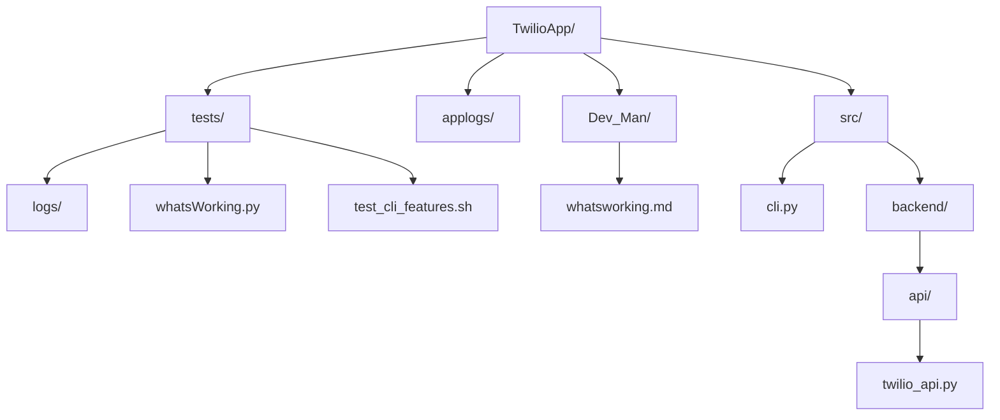

# 🚀 Twilio CLI Reporting Project: Feature Health & Learning Guide

I'm a curious developer and I want to learn how to build, test, and grow a CLI reporting app for Twilio call logs so I can automate insights and teach others best practices.

---

## 📦 App Structure

---

## 📝 Feature Health Table
| Feature | Emoji | Status | Description |
|---|---|---|---|
| Analyze logs | 1️⃣ | ❌ Not Used | Analyzes and displays call log data in a beautiful table. |
| Show summary | 2️⃣ | ❌ Not Used | Shows summary statistics for your call logs. |
| Visualize call volume | 3️⃣ | ❌ Not Used | (Stub) Will visualize call volume trends. |
| Exit | 4️⃣ | ❌ Not Used | Exits the CLI tool. |
---

## 📚 How the App Grows

- Each time you use a CLI feature, it is logged and tracked.
- This report updates automatically, teaching you which features are working and which need attention.
- As you add new features or wire in the API, they will appear here!

### Real-World Use Case
Imagine onboarding a new teammate: they can see at a glance what works, what’s next, and how to contribute.

---

## 🧑‍🏫 Next Steps

- Try using more CLI features and rerun this report!
- Add new reports or visualizations and see them show up here.
- When the API is ready, uncomment the mapping utility and connect your endpoints.

---

_Was this report helpful? What would you like to learn or automate next?_ 😊
