# 🔍 What's Working - Codebase Analysis Report

**Generated:** 2025-08-19 20:31:50
**Analyzed:** 130 Python files
**Total Lines of Code:** 26,930

---

## 📊 Summary Statistics

- **Files:** 130
- **Functions:** 746
- **Classes:** 128
- **Average LOC/File:** 207.2

### Files by Role:

- **Backend:** 11 files
- **CLI:** 4 files
- **Frontend:** 1 files
- **Test:** 26 files
- **Utility:** 88 files

---

## 🏗️ Architecture Overview

```mermaid
graph TB
    subgraph "🎯 Codebase Architecture"
        subgraph "📁 Other (128 files)"
            node_0["whatsWorking.py<br/>📄 Utility<br/>📊 271 LOC"]
            node_1["analyze_openrouter_detailed.py<br/>📄 Utility<br/>📊 177 LOC"]
            node_2["analyze_openrouter_integration.py<br/>📄 Utility<br/>📊 164 LOC"]
            node_3["analyze_openrouter_models.py<br/>📄 Utility<br/>📊 109 LOC"]
            node_4["analyze_questions.py<br/>📄 Utility<br/>📊 236 LOC"]
            node_5["index.py<br/>📄 Utility<br/>📊 32 LOC"]
            node_6["api_server.py<br/>📄 Backend<br/>📊 190 LOC"]
            node_7["check_runpod_account.py<br/>📄 Utility<br/>📊 102 LOC"]
            node_8["check_runpod_endpoint.py<br/>📄 Utility<br/>📊 105 LOC"]
            node_9["comprehensive_system_test.py<br/>🧪 Test<br/>📊 306 LOC"]
            more_node_10["... and 118 more files"]
        end
        subgraph "📁 🚪 Entry Points (1 files)"
            node_11["cli.py<br/>🚪 CLI<br/>📊 246 LOC"]
        end
        subgraph "📁 🎨 Frontend (1 files)"
            node_12["frontend_server.py<br/>📄 Frontend<br/>📊 81 LOC"]
        end
    end

    %% Key relationships
    node_0 --> node_9
    node_0 --> node_6
    node_1 --> node_9
    node_2 --> node_9
    node_4 --> node_9
    node_4 --> node_9
    node_5 --> node_9
    node_11 --> node_9
    node_11 --> node_12
    node_9 --> node_1
    node_12 --> node_9

    %% Styling
    style node_11 fill:#45b7d1
    style node_12 fill:#4ecdc4
```

---

## 🎯 Smart Data Workflow

The application implements a user-friendly data processing workflow:

```mermaid
graph TD
    subgraph "🎯 New Smart Data Workflow"
        direction TB
        
        A["📁 File Upload<br/>Select CSV/Excel"]
        
        B["📝 Data Prep Editor<br/>🆕 NEW STEP<br/>• Smart column editing<br/>• Multi-select concatenation<br/>• Version history<br/>• Undo/Redo<br/>• Clean preview"]
        
        C["🗺️ Pete Mapping<br/>• Enhanced readability<br/>• Better headers<br/>• Clean dropdowns<br/>• Visual feedback"]
        
        D["👁️ Preview & Export<br/>• Final review<br/>• Download options"]
        
        subgraph "📝 Data Prep Features"
            B1["🔗 Smart Merger<br/>• Select 2+ columns<br/>• Choose delimiter<br/>• Auto-suggest names<br/>• Keep/remove originals"]
            B2["📚 Version History<br/>• Every change tracked<br/>• Undo/Redo anytime<br/>• Change descriptions"]
            B3["✏️ Column Editing<br/>• Right-click operations<br/>• Rename columns<br/>• Clean interface"]
            B4["🔄 Reset Options<br/>• Back to original<br/>• Confirm changes<br/>• State management"]
        end
        
        subgraph "🎨 UX Improvements"
            UI1["📊 Better Headers<br/>• Blue styling<br/>• Readable text<br/>• Proper sizing"]
            UI2["🖱️ User-Friendly<br/>• Right-click menus<br/>• Clear buttons<br/>• Visual feedback"]
            UI3["⚡ Smart Workflow<br/>• Logical progression<br/>• Easy navigation<br/>• No confusion"]
        end
    end
    
    %% Main workflow
    A --> B
    B --> C
    C --> D
    
    %% Data prep features
    B --> B1
    B --> B2
    B --> B3
    B --> B4
    
    %% UI improvements
    B --> UI1
    C --> UI1
    B --> UI2
    C --> UI2
    A --> UI3
    B --> UI3
    
    %% Navigation
    B -.->|Back| A
    C -.->|Back| B
    D -.->|Back| C
    
    %% Styling
    style A fill:#e3f2fd
    style B fill:#c8e6c9
    style C fill:#fff3e0
    style D fill:#f3e5f5
    style B1 fill:#4caf50
    style B2 fill:#4caf50
    style B3 fill:#4caf50
    style B4 fill:#4caf50
    style UI1 fill:#1976d2
    style UI2 fill:#1976d2
    style UI3 fill:#1976d2
```

### Key Workflow Features:

- **📝 Data Preparation Editor**: New smart editor for preparing data before Pete mapping
- **🔗 Multi-Column Concatenation**: Select multiple columns and merge with custom delimiters
- **📚 Version History**: Full undo/redo with change tracking
- **🎨 Enhanced UI**: Better readability, clear headers, intuitive navigation
- **⚡ Logical Flow**: Upload → Prepare → Map → Export

---

## 🧮 Most Complex Files

| File | Complexity Score |
|------|------------------|
| `src/whats_working_analyzer.py` | 208 |
| `src/vapi/webhook_server_legacy.py` | 159 |
| `src/langchain/conversation_indexer.py` | 130 |
| `src/comprehensive_system_test_suite.py` | 128 |
| `src/vapi/conversation_manager.py` | 126 |

---

## 🔗 Most Connected Files

| File | Import Count |
|------|--------------|
| `src/vapi/webhook_server_legacy.py` | 25 |
| `src/comprehensive_system_test_suite.py` | 17 |
| `src/ai/model_manager.py` | 16 |
| `src/analytics/conversation_similarity.py` | 15 |
| `src/ollama_proxy_streaming.py` | 15 |

---

## 📋 Detailed File Analysis

### Backend Files (11)

#### 📄 `api_server.py`
**Lines:** 190 | **Complexity:** 17
- **External Imports:** fastapi, os, pydantic, typing, uvicorn
- **Local Imports:** runpod_handler
- **Classes:** ChatRequest, AdminRequest
- **Functions:** main
- **Special:** 🚪 Entry Point

#### 📄 `src/ai/model_preloader.py`
**Lines:** 186 | **Complexity:** 53
- **External Imports:** asyncio, concurrent, loguru, subprocess, threading, time, typing
- **Classes:** OllamaModelPreloader
- **Functions:** __init__, is_model_loaded, preload_model, unload_model, preload_jamie_models (+7 more)

#### 📄 `src/analytics/benchmark_analyzer.py`
**Lines:** 298 | **Complexity:** 110
- **External Imports:** json, loguru, pandas, pathlib, pendulum, typing
- **Local Imports:** benchmark_models
- **Classes:** BenchmarkAnalyzer
- **Functions:** __init__, load_benchmark_data, load_all_benchmark_data, load_benchmark_data_for_range, _flatten_dataframe (+8 more)

#### 📄 `src/analytics/benchmark_models.py`
**Lines:** 106 | **Complexity:** 75
- **External Imports:** datetime, pendulum, pydantic, typing
- **Classes:** PerformanceMetrics, QualityMetrics, BenchmarkRecord, BenchmarkSummary, ModelComparison
- **Functions:** pendulum_timestamp, response_rate_chars_per_second, is_fast_response, is_quality_response, fast_response_rate (+2 more)
- **Decorators:** property

#### 📄 `src/main_app.py`
**Lines:** 10 | **Complexity:** 0
- **External Imports:** uvicorn, vapi

#### 📄 `src/ollama_proxy.py`
**Lines:** 151 | **Complexity:** 18
- **External Imports:** datetime, fastapi, httpx, json, loguru, os, pydantic, typing, uvicorn
- **Classes:** ChatMessage, ChatCompletionRequest, ChatCompletionResponse
- **Functions:** verify_api_key

#### 📄 `src/vapi/api/system_config_router.py`
**Lines:** 198 | **Complexity:** 38
- **External Imports:** fastapi, pydantic, typing
- **Local Imports:** config, utils
- **Classes:** CachingConfigUpdate, ProviderConfigUpdate, ModelConfigUpdate, SystemConfigUpdate
- **Functions:** create_system_config_router

#### 📄 `src/vapi/models/webhook_models.py`
**Lines:** 165 | **Complexity:** 119
- **External Imports:** datetime, pydantic, typing
- **Classes:** VAPIMessage, VAPIChatRequest, VAPIChatResponse, ProviderError, ModelAvailabilityError, ModelInfo, PersonaModel, Persona, ProviderSettings, ProviderStatus, TestModelRequest, ModelPreloadRequest, ConversationStreamRequest, ModelSettingsUpdate, ProviderTestRequest, PerformanceMetrics, QualityMetrics, BenchmarkRecord, SystemStatus
- **Functions:** create_error_response, create_model_availability_error

#### 📄 `src/vapi/modular_server.py`
**Lines:** 169 | **Complexity:** 46
- **External Imports:** ai, argparse, fastapi, os, pathlib, sys, unittest, uvicorn, vapi
- **Local Imports:** utils
- **Classes:** ModularVAPIServer
- **Functions:** create_app, main, __init__, _setup_services, _setup_static_files (+3 more)
- **Special:** 🚪 Entry Point

#### 📄 `src/vapi/webhook_server_legacy.py`
**Lines:** 4394 | **Complexity:** 159
- **External Imports:** ai, analytics, asyncio, database, datetime, fastapi, json, os, pathlib, pendulum, platform, pydantic, re, requests, shutil, sqlite3, subprocess, sys, time, typing, urllib, uvicorn
- **Local Imports:** config, utils, virtual_jamie_extractor
- **Classes:** VAPIMessage, VAPIChatRequest, VAPIChatResponse, ProviderError, ModelAvailabilityError, VAPIWebhookServer
- **Functions:** __init__, verify_vapi_auth, setup_routes, _process_openrouter_api_models, _convert_api_model_to_our_format (+14 more)

#### 📄 `src/virtual_jamie_extractor.py`
**Lines:** 225 | **Complexity:** 56
- **External Imports:** datetime, dotenv, loguru, os, pandas, sqlalchemy, sqlite3
- **Classes:** VirtualJamieDataExtractor
- **Functions:** main, __init__, _get_default_db_path, load_environment, setup_prod_connection (+5 more)
- **Special:** 🚪 Entry Point

### CLI Files (4)

#### 📄 `cli.py`
**Lines:** 246 | **Complexity:** 55
- **External Imports:** argparse, pathlib, requests, src, subprocess, sys, time
- **Functions:** check_docker_running, check_service_health, start_containers, stop_containers, wait_for_services (+6 more)
- **Special:** 🚪 Entry Point | 🧪 Has Tests

#### 📄 `src/main.py`
**Lines:** 88 | **Complexity:** 20
- **External Imports:** ai, asyncio, atexit, dotenv, os, pathlib, signal, subprocess, sys, threading, uvicorn, vapi
- **Local Imports:** startup_warmup, utils
- **Functions:** cleanup_resources, signal_handler, main, background_warmup
- **Special:** 🚪 Entry Point

#### 📄 `src/whatsworking_platform/cli/main.py`
**Lines:** 219 | **Complexity:** 42
- **External Imports:** argparse, asyncio, pathlib, rich, sys, typing
- **Local Imports:** core
- **Classes:** WhatsWorkingCLI
- **Functions:** __init__, _display_analysis_results, show_help

#### 📄 `src/whatsworking_platform/main.py`
**Lines:** 56 | **Complexity:** 0
- **External Imports:** asyncio, pathlib, sys
- **Local Imports:** cli

### Frontend Files (1)

#### 📄 `src/frontend/frontend_server.py`
**Lines:** 81 | **Complexity:** 28
- **External Imports:** fastapi, os, pathlib, sys, uvicorn
- **Functions:** create_frontend_server, main
- **Special:** 🚪 Entry Point

### Test Files (26)

#### 📄 `comprehensive_system_test.py`
**Lines:** 306 | **Complexity:** 51
- **External Imports:** ai, concurrent, json, os, pathlib, sys, threading, time
- **Local Imports:** config, utils
- **Functions:** test_configuration_loading, test_provider_switching, test_caching_behavior, test_model_configuration, test_race_conditions (+5 more)
- **Special:** 🚪 Entry Point | 🧪 Has Tests

#### 📄 `create_test_suite.py`
**Lines:** 214 | **Complexity:** 71
- **External Imports:** analytics, collections, json, pathlib, sys, typing
- **Functions:** extract_questions_from_similarity_system, categorize_questions, create_test_cases, generate_question_variations, create_performance_test_suite (+1 more)
- **Special:** 🚪 Entry Point | 🧪 Has Tests

#### 📄 `rp_handler_local_test.py`
**Lines:** 50 | **Complexity:** 23
- **External Imports:** dotenv, json, os, pathlib, sys
- **Functions:** test_endpoint, get_endpoint_url
- **Special:** 🧪 Has Tests

#### 📄 `src/comprehensive_system_test_suite.py`
**Lines:** 659 | **Complexity:** 128
- **External Imports:** ai, asyncio, dataclasses, datetime, json, os, pathlib, requests, sys, time, traceback, typing, vapi
- **Local Imports:** config, openrouter_handler, runpod_handler, utils
- **Classes:** TestResult, TestSuiteResult, ComprehensiveSystemTestSuite
- **Functions:** main, __post_init__, success_rate, __init__, log_test_result (+17 more)
- **Decorators:** property, beartype
- **Special:** 🚪 Entry Point | 🧪 Has Tests

#### 📄 `src/test_ui_route.py`
**Lines:** 30 | **Complexity:** 0
- **External Imports:** fastapi, uvicorn

#### 📄 `test_default_model.py`
**Lines:** 101 | **Complexity:** 20
- **External Imports:** json, os, requests
- **Functions:** test_default_models
- **Special:** 🧪 Has Tests

#### 📄 `test_direct_endpoint.py`
**Lines:** 140 | **Complexity:** 20
- **External Imports:** json, os, requests
- **Functions:** test_direct_endpoint
- **Special:** 🧪 Has Tests

#### 📄 `test_endpoint_connectivity.py`
**Lines:** 117 | **Complexity:** 39
- **External Imports:** os, requests, socket, subprocess, sys, urllib
- **Functions:** test_dns_resolution, test_port_connectivity, test_http_connectivity, test_curl_connectivity, main
- **Special:** 🚪 Entry Point | 🧪 Has Tests

#### 📄 `test_native_api.py`
**Lines:** 86 | **Complexity:** 17
- **External Imports:** json, os, requests
- **Functions:** test_native_api
- **Special:** 🧪 Has Tests

#### 📄 `test_openai_models.py`
**Lines:** 98 | **Complexity:** 26
- **External Imports:** json, os, requests
- **Functions:** test_openai_models
- **Special:** 🧪 Has Tests

#### 📄 `test_openrouter_chat.py`
**Lines:** 193 | **Complexity:** 0
- **External Imports:** aiohttp, asyncio, json, os, pathlib, sys, time, typing

#### 📄 `test_openrouter_integration.py`
**Lines:** 178 | **Complexity:** 2
- **External Imports:** asyncio, json, os, pathlib, requests, sys, traceback, typing, vapi
- **Functions:** main
- **Special:** 🚪 Entry Point

#### 📄 `test_provider_api.py`
**Lines:** 67 | **Complexity:** 0
- **External Imports:** fastapi, pathlib, sys, uvicorn
- **Local Imports:** config

#### 📄 `test_provider_comparison.py`
**Lines:** 292 | **Complexity:** 71
- **External Imports:** json, time, typing
- **Local Imports:** model_router
- **Functions:** test_truncation_scenarios, analyze_response_quality, test_vapi_webhook_comparison, generate_comparison_report, main
- **Special:** 🚪 Entry Point | 🧪 Has Tests

#### 📄 `test_provider_switching_e2e.py`
**Lines:** 337 | **Complexity:** 92
- **External Imports:** asyncio, json, pathlib, sys, time, traceback
- **Classes:** ProviderSwitchingE2ETest
- **Functions:** main, __init__, log_issue, log_dependency, log_race_condition (+9 more)
- **Special:** 🚪 Entry Point | 🧪 Has Tests

#### 📄 `test_runpod_ai_alternative.py`
**Lines:** 77 | **Complexity:** 17
- **External Imports:** json, os, requests
- **Functions:** test_alternative_apis
- **Special:** 🧪 Has Tests

#### 📄 `test_runpod_ai_endpoints.py`
**Lines:** 86 | **Complexity:** 18
- **External Imports:** json, os, requests
- **Functions:** test_runpod_ai_endpoints
- **Special:** 🧪 Has Tests

#### 📄 `test_runpod_ai_health.py`
**Lines:** 69 | **Complexity:** 19
- **External Imports:** json, os, requests
- **Functions:** test_runpod_ai_health
- **Special:** 🧪 Has Tests

#### 📄 `test_simple_server.py`
**Lines:** 54 | **Complexity:** 20
- **External Imports:** fastapi, os, pathlib, sys, uvicorn
- **Functions:** create_simple_server, main
- **Special:** 🚪 Entry Point

#### 📄 `test_system_config.py`
**Lines:** 118 | **Complexity:** 19
- **External Imports:** os, pathlib, sys, traceback
- **Local Imports:** config
- **Functions:** test_system_config, test_caching_behavior, main
- **Special:** 🚪 Entry Point | 🧪 Has Tests

#### 📄 `test_updated_handler.py`
**Lines:** 140 | **Complexity:** 2
- **External Imports:** asyncio, loguru, os, pathlib, sys
- **Local Imports:** serverless_handler
- **Functions:** main
- **Special:** 🚪 Entry Point

#### 📄 `test_working_models.py`
**Lines:** 85 | **Complexity:** 23
- **External Imports:** json, requests, time
- **Functions:** test_model_accessibility
- **Special:** 🧪 Has Tests

#### 📄 `tests/test_full_conversations.py`
**Lines:** 111 | **Complexity:** 32
- **External Imports:** json, os, pathlib, src, sys
- **Functions:** show_sample_conversations, demonstrate_full_vs_fragment, test_complete_conversation_training, main
- **Special:** 🚪 Entry Point | 🧪 Has Tests

#### 📄 `tests/test_jamie_manual.py`
**Lines:** 77 | **Complexity:** 13
- **External Imports:** subprocess, sys
- **Functions:** test_jamie_model, quick_test
- **Special:** 🧪 Has Tests

#### 📄 `tests/test_runpod_handler.py`
**Lines:** 202 | **Complexity:** 47
- **External Imports:** fastapi, json, os, pathlib, sys
- **Local Imports:** api_server, runpod_handler
- **Classes:** MockRunPodClient, MockRunPodClient
- **Functions:** test_environment_setup, test_runpod_client_init, test_pete_handler_init, test_api_server, test_chat_request_format (+5 more)
- **Special:** 🚪 Entry Point | 🧪 Has Tests

#### 📄 `tests/test_serverless_integration.py`
**Lines:** 34 | **Complexity:** 0
- **External Imports:** asyncio, dotenv, os, src, traceback

### Utility Files (88)

#### 📄 `DEV_MAN/whatsWorking.py`
**Lines:** 271 | **Complexity:** 72
- **External Imports:** datetime, dotenv, importlib, json, os, pathlib, requests, sys, typing
- **Local Imports:** api_server, runpod_handler
- **Classes:** ServerlessStatus
- **Functions:** create_status_wireframe, main, __init__, check_environment, check_files (+4 more)
- **Special:** 🚪 Entry Point | 🧪 Has Tests

#### 📄 `analyze_openrouter_detailed.py`
**Lines:** 177 | **Complexity:** 2
- **External Imports:** asyncio, json, os, pathlib, sys, traceback, vapi
- **Local Imports:** config
- **Functions:** main
- **Special:** 🚪 Entry Point

#### 📄 `analyze_openrouter_integration.py`
**Lines:** 164 | **Complexity:** 4
- **External Imports:** json, os, pathlib, sys, traceback, vapi
- **Local Imports:** config
- **Functions:** analyze_openrouter_integration

#### 📄 `analyze_openrouter_models.py`
**Lines:** 109 | **Complexity:** 7
- **External Imports:** json, os, requests, typing
- **Functions:** analyze_openrouter_models

#### 📄 `analyze_questions.py`
**Lines:** 236 | **Complexity:** 80
- **External Imports:** collections, json, pathlib, re, sys, typing
- **Functions:** clean_question, extract_questions, normalize_question, categorize_question, analyze_conversations (+2 more)
- **Special:** 🚪 Entry Point | 🧪 Has Tests

#### 📄 `api/index.py`
**Lines:** 32 | **Complexity:** 0
- **External Imports:** fastapi, os, pathlib, sys, vapi

#### 📄 `check_runpod_account.py`
**Lines:** 102 | **Complexity:** 21
- **External Imports:** json, os, requests
- **Functions:** check_runpod_account, main
- **Special:** 🚪 Entry Point

#### 📄 `check_runpod_endpoint.py`
**Lines:** 105 | **Complexity:** 17
- **External Imports:** datetime, json, os, requests
- **Functions:** check_runpod_endpoint, main
- **Special:** 🚪 Entry Point

#### 📄 `create_working_jamie_model.py`
**Lines:** 125 | **Complexity:** 21
- **External Imports:** os, pathlib, src, subprocess, sys
- **Functions:** create_simple_working_modelfile, test_model_responses
- **Special:** 🧪 Has Tests

#### 📄 `debug_webhook_server.py`
**Lines:** 61 | **Complexity:** 8
- **External Imports:** os, pathlib, sys, traceback, uvicorn, vapi
- **Functions:** debug_route_registration, main
- **Special:** 🚪 Entry Point

#### 📄 `dev_server.py`
**Lines:** 113 | **Complexity:** 43
- **External Imports:** os, pathlib, signal, subprocess, sys, threading, time, watchdog
- **Classes:** ServerRestartHandler
- **Functions:** main, __init__, on_modified, restart_server, start_server (+2 more)
- **Special:** 🚪 Entry Point

#### 📄 `diagnose_endpoint.py`
**Lines:** 86 | **Complexity:** 2
- **External Imports:** asyncio, loguru, os, pathlib, sys
- **Local Imports:** serverless_handler
- **Functions:** main
- **Special:** 🚪 Entry Point

#### 📄 `enhanced_model_trainer.py`
**Lines:** 379 | **Complexity:** 117
- **External Imports:** database, datetime, json, os, pathlib, re, sqlite3, subprocess, sys, typing
- **Classes:** PropertyManagementModelfileGenerator
- **Functions:** main, __init__, extract_conversations, _clean_transcription, _categorize_conversation (+13 more)
- **Special:** 🚪 Entry Point

#### 📄 `list_runpod_endpoints.py`
**Lines:** 92 | **Complexity:** 17
- **External Imports:** json, os, requests
- **Functions:** list_runpod_endpoints, main
- **Special:** 🚪 Entry Point

#### 📄 `model_router.py`
**Lines:** 318 | **Complexity:** 101
- **External Imports:** json, ollama, os, pathlib, requests, typing
- **Local Imports:** openrouter_handler, runpod_handler
- **Classes:** ModelRouter
- **Functions:** main, __init__, _load_config, get_provider_for_model, route_chat_completion (+9 more)
- **Special:** 🚪 Entry Point | 🧪 Has Tests

#### 📄 `openrouter_handler.py`
**Lines:** 265 | **Complexity:** 76
- **External Imports:** dotenv, json, os, requests, typing
- **Classes:** OpenRouterClient, OpenRouterHandler
- **Functions:** main, __init__, get_models, chat_completion, vapi_webhook_response (+4 more)
- **Special:** 🚪 Entry Point

#### 📄 `openrouter_models.py`
**Lines:** 271 | **Complexity:** 81
- **External Imports:** dotenv, json, os, requests, typing
- **Classes:** OpenRouterModelManager
- **Functions:** main, __init__, get_all_models, get_free_models, get_cheap_models (+6 more)
- **Special:** 🚪 Entry Point | 🧪 Has Tests

#### 📄 `provider_control_demo.py`
**Lines:** 135 | **Complexity:** 76
- **External Imports:** json, os, pathlib, requests
- **Functions:** load_current_config, show_current_status, show_switch_options, demonstrate_switching, check_environment_vars (+1 more)
- **Special:** 🚪 Entry Point

#### 📄 `rp_handler.py`
**Lines:** 151 | **Complexity:** 13
- **External Imports:** database, dotenv, json, os, pathlib, runpod, sys, vapi
- **Local Imports:** config, ollama_proxy_streaming, utils
- **Functions:** handler, handle_webhook_request, handle_chat_request, handle_admin_request, health_check (+1 more)

#### 📄 `runpod_backward_compatible_handler.py`
**Lines:** 145 | **Complexity:** 18
- **External Imports:** json, os, requests, runpod, typing
- **Functions:** handler, handle_structured_format, handle_prompt_format, process_with_ollama, template (+1 more)

#### 📄 `runpod_handler.py`
**Lines:** 299 | **Complexity:** 107
- **External Imports:** dotenv, json, os, requests, time, typing
- **Classes:** RunPodServerlessClient, PeteOllamaHandler
- **Functions:** main, __init__, submit_job, get_job_status, submit_sync_job (+8 more)
- **Special:** 🚪 Entry Point

#### 📄 `setup_openrouter.py`
**Lines:** 195 | **Complexity:** 52
- **External Imports:** dotenv, os, requests
- **Functions:** setup_openrouter_api_key, test_api_key, show_recommended_models, test_model_request, check_current_setup (+1 more)
- **Special:** 🚪 Entry Point | 🧪 Has Tests

#### 📄 `smart_model_versioner.py`
**Lines:** 278 | **Complexity:** 66
- **External Imports:** database, datetime, hashlib, json, os, pathlib, sqlite3, subprocess, sys, typing
- **Local Imports:** enhanced_model_trainer
- **Classes:** SmartModelVersioner
- **Functions:** main, __init__, _load_version_history, _save_version_history, _calculate_training_data_hash (+9 more)
- **Special:** 🚪 Entry Point

#### 📄 `src/__init__.py`
**Lines:** 0 | **Complexity:** 0
- **Special:** 📦 Init File

#### 📄 `src/ai/__init__.py`
**Lines:** 0 | **Complexity:** 0
- **Special:** 📦 Init File

#### 📄 `src/ai/model_manager.py`
**Lines:** 477 | **Complexity:** 94
- **External Imports:** ai, analytics, database, json, os, pathlib, re, requests, sys, time, typing
- **Local Imports:** config, openrouter_handler, response_cache, runpod_handler, utils
- **Classes:** ModelManager
- **Functions:** __init__, _get_similarity_analyzer, _get_openrouter_handler, _get_current_provider, _route_to_provider (+15 more)
- **Special:** 🧪 Has Tests

#### 📄 `src/ai/response_cache.py`
**Lines:** 332 | **Complexity:** 98
- **External Imports:** json, loguru, os, pathlib, re, time, typing
- **Classes:** ResponseCache
- **Functions:** get_instant_response, __init__, load_cache, _extract_patterns, _classify_response_topic (+10 more)

#### 📄 `src/analytics/__init__.py`
**Lines:** 0 | **Complexity:** 0
- **Special:** 📦 Init File

#### 📄 `src/analytics/conversation_similarity.py`
**Lines:** 393 | **Complexity:** 87
- **External Imports:** dataclasses, json, langchain_community, langchain_core, langchain_huggingface, langchain_text_splitters, loguru, multiprocessing, os, pathlib, re, sqlite3, sys, torch, typing
- **Classes:** ConversationSample, SimilarityResult, ConversationSimilarityAnalyzer
- **Functions:** __init__, _load_indexed_conversations, _create_fallback_samples, _initialize_embeddings, calculate_similarity (+6 more)

#### 📄 `src/analytics/response_parser.py`
**Lines:** 133 | **Complexity:** 54
- **External Imports:** dataclasses, loguru, re, typing
- **Classes:** ParsedResponse, ResponseParser
- **Functions:** __init__, parse_response, _clean_agent_response, _extract_thinking_process, _calculate_confidence (+4 more)

#### 📄 `src/analytics/response_validator.py`
**Lines:** 283 | **Complexity:** 97
- **External Imports:** collections, datetime, json, loguru, pathlib, pydantic, typing
- **Local Imports:** conversation_similarity
- **Classes:** JamieResponsePattern, ResponseValidationResult, ResponseValidator
- **Functions:** validate_length, no_conversation_simulation, no_system_bleed, __init__, analyze_response_pattern (+7 more)

#### 📄 `src/analyze_ollama_agent.py`
**Lines:** 222 | **Complexity:** 40
- **External Imports:** ai, os, pathlib, requests, sys
- **Local Imports:** config, whatsWorking
- **Classes:** OllamaAgentAnalyzer
- **Functions:** __init__, check_system_config, check_provider_routing, check_caching_behavior, run_full_analysis

#### 📄 `src/config/__init__.py`
**Lines:** 1 | **Complexity:** 0
- **Special:** 📦 Init File

#### 📄 `src/config/model_settings.py`
**Lines:** 320 | **Complexity:** 90
- **External Imports:** dataclasses, datetime, json, loguru, os, pathlib, sys, typing
- **Local Imports:** utils
- **Classes:** ModelConfig, ModelSettingsManager
- **Functions:** __post_init__, __init__, load_settings, save_settings, _init_default_models (+14 more)
- **Decorators:** error_boundary

#### 📄 `src/config/system_config.py`
**Lines:** 371 | **Complexity:** 113
- **External Imports:** dataclasses, json, os, pathlib, typing
- **Local Imports:** utils
- **Classes:** CachingConfig, ProviderConfig, ModelConfig, SystemConfig, SystemConfigManager
- **Functions:** __post_init__, __post_init__, __post_init__, __init__, _load_default_config (+13 more)
- **Decorators:** beartype

#### 📄 `src/database/__init__.py`
**Lines:** 0 | **Complexity:** 0
- **Special:** 📦 Init File

#### 📄 `src/database/pete_db_manager.py`
**Lines:** 189 | **Complexity:** 35
- **External Imports:** os, pathlib, sqlite3, typing
- **Classes:** PeteDBManager
- **Functions:** __init__, _find_pete_db, get_connection, is_connected, get_training_stats (+5 more)

#### 📄 `src/extract_jamie_data.py`
**Lines:** 55 | **Complexity:** 8
- **External Imports:** os, sys
- **Local Imports:** virtual_jamie_extractor
- **Functions:** main
- **Special:** 🚪 Entry Point

#### 📄 `src/full_whats_working_analysis.py`
**Lines:** 135 | **Complexity:** 10
- **External Imports:** asyncio, pathlib, sys, whatsworking_platform
- **Classes:** OllamaAgentWhatsWorkingAnalyzer
- **Functions:** __init__

#### 📄 `src/generate_visual_documentation.py`
**Lines:** 412 | **Complexity:** 39
- **External Imports:** ai, asyncio, datetime, json, pathlib, sys, whatsworking_platform
- **Local Imports:** config, full_whats_working_analysis
- **Classes:** VisualDocumentationGenerator
- **Functions:** __init__, generate_mermaid_architecture, generate_system_health_report, generate_codebase_analysis, generate_whats_working_report (+1 more)

#### 📄 `src/langchain/__init__.py`
**Lines:** 10 | **Complexity:** 0
- **Special:** 📦 Init File

#### 📄 `src/langchain/basic_research_agent.py`
**Lines:** 217 | **Complexity:** 41
- **External Imports:** duckduckgo_search, json, logging, os, pathlib, requests, typing
- **Classes:** BasicResearchAgent
- **Functions:** __init__, query_ollama, search_web, research_ollama_best_practices, analyze_existing_project_files (+2 more)

#### 📄 `src/langchain/conversation_indexer.py`
**Lines:** 466 | **Complexity:** 130
- **External Imports:** database, datetime, json, os, pandas, pathlib, re, sqlite3, sys, typing
- **Local Imports:** utils
- **Classes:** ConversationIndexer
- **Functions:** __init__, load_conversations, _is_quality_phone_call, identify_speakers, extract_client_info (+10 more)

#### 📄 `src/langchain/jamie_trainer.py`
**Lines:** 133 | **Complexity:** 53
- **External Imports:** datetime, os, pathlib, sys
- **Local Imports:** conversation_indexer, smart_modelfile_generator, utils
- **Classes:** JamieTrainer
- **Functions:** main, __init__, run_complete_training, _log_analysis_summary, test_model (+1 more)
- **Special:** 🚪 Entry Point | 🧪 Has Tests

#### 📄 `src/langchain/ollama_research_agent.py`
**Lines:** 263 | **Complexity:** 50
- **External Imports:** json, langchain, langchain_community, langchain_ollama, logging, os, pathlib, typing
- **Classes:** OllamaResearchAgent
- **Functions:** main, __init__, research_ollama_best_practices, analyze_existing_project_files, synthesize_modelfile_guidelines (+2 more)
- **Special:** 🚪 Entry Point

#### 📄 `src/langchain/simplified_research_agent.py`
**Lines:** 185 | **Complexity:** 37
- **External Imports:** json, langchain_community, langchain_ollama, logging, os, pathlib, typing
- **Classes:** SimplifiedResearchAgent
- **Functions:** __init__, research_ollama_best_practices, analyze_existing_project_files, generate_optimized_modelfile, save_research_report

#### 📄 `src/langchain/smart_modelfile_generator.py`
**Lines:** 282 | **Complexity:** 73
- **External Imports:** datetime, json, os, pathlib, requests, sys, typing
- **Local Imports:** conversation_indexer, utils
- **Classes:** SmartModelfileGenerator
- **Functions:** main, __init__, load_indexed_data, generate_from_live_data, select_best_examples (+5 more)
- **Special:** 🚪 Entry Point

#### 📄 `src/ollama_proxy_streaming.py`
**Lines:** 282 | **Complexity:** 23
- **External Imports:** asyncio, datetime, fastapi, httpx, json, loguru, os, pathlib, pydantic, sys, typing, uuid, uvicorn, vapi
- **Local Imports:** config
- **Classes:** ChatMessage, ChatCompletionRequest, ChatCompletionResponse
- **Functions:** process_response_for_vapi

#### 📄 `src/openrouter_handler.py`
**Lines:** 282 | **Complexity:** 79
- **External Imports:** dotenv, json, os, requests, typing
- **Local Imports:** utils
- **Classes:** OpenRouterClient, OpenRouterHandler
- **Functions:** main, __init__, get_models, chat_completion, vapi_webhook_response (+4 more)
- **Special:** 🚪 Entry Point

#### 📄 `src/serverless_handler.py`
**Lines:** 355 | **Complexity:** 22
- **External Imports:** aiohttp, asyncio, dotenv, json, loguru, os, socket, ssl, typing
- **Classes:** ServerlessHandler
- **Functions:** __init__

#### 📄 `src/startup_warmup.py`
**Lines:** 63 | **Complexity:** 2
- **External Imports:** asyncio, loguru, os
- **Local Imports:** serverless_handler
- **Functions:** run_warmup

#### 📄 `src/utils/__init__.py`
**Lines:** 0 | **Complexity:** 0
- **Special:** 📦 Init File

#### 📄 `src/utils/app_utilities.py`
**Lines:** 323 | **Complexity:** 56
- **External Imports:** datetime, functools, json, os, pathlib, sys, time, traceback, typing
- **Local Imports:** utils
- **Classes:** AppUtilities
- **Functions:** safe_type_check, safe_dict_access, validate_required_fields, validate_field_types, load_config_file (+14 more)
- **Decorators:** staticmethod

#### 📄 `src/utils/datetime_utils.py`
**Lines:** 207 | **Complexity:** 59
- **External Imports:** datetime, pendulum, typing
- **Classes:** DateTimeUtils
- **Functions:** now_cst, format_datetime_display, format_datetime_api, format_datetime_filename, get_time_ago_cst (+11 more)
- **Decorators:** staticmethod

#### 📄 `src/utils/enhanced_model_discovery.py`
**Lines:** 208 | **Complexity:** 59
- **External Imports:** datetime, json, loguru, pathlib, re, subprocess, typing
- **Classes:** EnhancedModelDiscovery
- **Functions:** __init__, discover_available_models, _analyze_model_name, _is_base_model, generate_model_configs (+7 more)

#### 📄 `src/utils/logger.py`
**Lines:** 56 | **Complexity:** 8
- **External Imports:** loguru, os, pathlib, pendulum, sys, time
- **Functions:** get_cst_time, setup_logger, get_logger

#### 📄 `src/utils/model_discovery.py`
**Lines:** 128 | **Complexity:** 47
- **External Imports:** json, loguru, pathlib, subprocess, typing
- **Classes:** ModelDiscovery
- **Functions:** main, __init__, load_config, discover_available_models, sync_config_with_reality (+4 more)
- **Special:** 🚪 Entry Point

#### 📄 `src/utils/type_validation.py`
**Lines:** 264 | **Complexity:** 56
- **External Imports:** beartype, functools, inspect, json, typing
- **Local Imports:** utils
- **Classes:** TypeValidationError
- **Functions:** validate_and_log_types, validate_config_structure, validate_provider_config, validate_caching_config, safe_json_parse (+7 more)
- **Decorators:** validate_and_log_types

#### 📄 `src/vapi/__init__.py`
**Lines:** 0 | **Complexity:** 0
- **Special:** 📦 Init File

#### 📄 `src/vapi/api/__init__.py`
**Lines:** 0 | **Complexity:** 0
- **Special:** 📦 Init File

#### 📄 `src/vapi/api/admin_router.py`
**Lines:** 744 | **Complexity:** 40
- **External Imports:** ai, asyncio, fastapi, json, os, pathlib, platform, psutil, socket, sys, time, typing, vapi
- **Local Imports:** config, utils
- **Classes:** AdminRouter
- **Functions:** create_admin_router, __init__, _setup_routes

#### 📄 `src/vapi/api/ui_router.py`
**Lines:** 249 | **Complexity:** 31
- **External Imports:** ai, fastapi, json, pathlib, sys, time, typing, vapi
- **Local Imports:** config, utils
- **Classes:** UIRouter
- **Functions:** create_ui_router, __init__, _setup_routes, token_iter, simulate_stream

#### 📄 `src/vapi/api/vapi_router.py`
**Lines:** 370 | **Complexity:** 56
- **External Imports:** ai, datetime, fastapi, json, os, pathlib, sys, time, typing, vapi
- **Local Imports:** config, utils
- **Classes:** VAPIRouter
- **Functions:** create_vapi_router, __init__, verify_vapi_auth, _setup_routes, _store_conversation_update (+5 more)

#### 📄 `src/vapi/conversation_manager.py`
**Lines:** 236 | **Complexity:** 126
- **External Imports:** dataclasses, datetime, loguru, re, threading, time, typing, uuid
- **Classes:** ConversationSession, ConversationManager, ResponseCleaner, ThreadManager
- **Functions:** __init__, _start_cleanup_thread, create_conversation, get_conversation, add_to_context (+19 more)
- **Decorators:** staticmethod

#### 📄 `src/vapi/models/__init__.py`
**Lines:** 0 | **Complexity:** 0
- **Special:** 📦 Init File

#### 📄 `src/vapi/services/__init__.py`
**Lines:** 0 | **Complexity:** 0
- **Special:** 📦 Init File

#### 📄 `src/vapi/services/provider_service.py`
**Lines:** 373 | **Complexity:** 39
- **External Imports:** datetime, os, pathlib, requests, sys, typing, vapi
- **Local Imports:** config, utils
- **Classes:** ProviderService
- **Functions:** __init__, _process_openrouter_api_models, _convert_api_model_to_our_format, _is_suitable_for_property_management, _create_display_name (+4 more)

#### 📄 `src/webhook_only.py`
**Lines:** 23 | **Complexity:** 9
- **External Imports:** asyncio, pathlib, sys, vapi
- **Local Imports:** utils
- **Functions:** main
- **Special:** 🚪 Entry Point

#### 📄 `src/whats_working/__init__.py`
**Lines:** 33 | **Complexity:** 0
- **External Imports:** analyzer, health_monitor, updater
- **Local Imports:** core, feature_tracker
- **Special:** 📦 Init File

#### 📄 `src/whats_working/core.py`
**Lines:** 152 | **Complexity:** 60
- **External Imports:** analyzer, datetime, health_monitor, json, os, pathlib, sys, typing, updater
- **Local Imports:** feature_tracker
- **Classes:** WhatsWorking
- **Functions:** __init__, analyze_codebase, track_features, update_test_results, get_system_health (+3 more)
- **Special:** 🧪 Has Tests

#### 📄 `src/whats_working_analyzer.py`
**Lines:** 1015 | **Complexity:** 208
- **External Imports:** ast, collections, dataclasses, fnmatch, json, os, pathlib, pendulum, re, sys, typing
- **Local Imports:** backend
- **Classes:** FileAnalysis, ArchitectureDiagramGenerator, CodebaseAnalyzer
- **Functions:** main, __init__, _load_config, _get_default_config, _matches_pattern (+18 more)
- **Special:** 🚪 Entry Point

#### 📄 `src/whats_working_feature_tracker.py`
**Lines:** 101 | **Complexity:** 23
- **External Imports:** datetime, loguru, os, rich
- **Functions:** parse_logs, build_feature_table, build_md_table, build_growth_section, main
- **Special:** 🚪 Entry Point

#### 📄 `src/whats_working_updater.py`
**Lines:** 50 | **Complexity:** 3
- **External Imports:** datetime, glob, loguru, os
- **Functions:** find_latest
- **Special:** 🧪 Has Tests

#### 📄 `src/whatsworking_platform/__init__.py`
**Lines:** 26 | **Complexity:** 0
- **External Imports:** collectors
- **Local Imports:** cli, core
- **Special:** 📦 Init File

#### 📄 `src/whatsworking_platform/cli/__init__.py`
**Lines:** 6 | **Complexity:** 0
- **Local Imports:** main
- **Special:** 📦 Init File

#### 📄 `src/whatsworking_platform/collectors/__init__.py`
**Lines:** 16 | **Complexity:** 0
- **Local Imports:** codebase_analyzer, feature_tracker, infrastructure_monitor
- **Special:** 📦 Init File

#### 📄 `src/whatsworking_platform/collectors/codebase_analyzer.py`
**Lines:** 241 | **Complexity:** 86
- **External Imports:** ast, collections, dataclasses, os, pathlib, pendulum, typing
- **Classes:** FileAnalysis, CodebaseAnalyzer, InfrastructureAnalyzer, TestResultsAggregator, FeatureUsageTracker
- **Functions:** __init__, get_all_py_files, analyze_file, _classify_role, analyze_codebase (+7 more)

#### 📄 `src/whatsworking_platform/collectors/feature_tracker.py`
**Lines:** 198 | **Complexity:** 82
- **External Imports:** datetime, importlib, json, os, pathlib, requests, rich, typing
- **Classes:** ReportGenerator, StatusReporter
- **Functions:** __init__, generate_codebase_report, generate_health_report, generate_goals_report, save_report (+8 more)

#### 📄 `src/whatsworking_platform/collectors/infrastructure_monitor.py`
**Lines:** 122 | **Complexity:** 25
- **External Imports:** os, pathlib, rich, shutil, typing
- **Classes:** CodeFinder
- **Functions:** __init__, _directory_has_code_files, search, copy_items, _search_recursive

#### 📄 `src/whatsworking_platform/core/__init__.py`
**Lines:** 15 | **Complexity:** 0
- **Local Imports:** config, engine, models
- **Special:** 📦 Init File

#### 📄 `src/whatsworking_platform/core/config.py`
**Lines:** 121 | **Complexity:** 39
- **External Imports:** dataclasses, json, os, pathlib, typing
- **Classes:** PlatformConfig
- **Functions:** from_file, save_to_file, get_validation_threshold, is_methodology_requirement_enabled, to_dict
- **Decorators:** classmethod

#### 📄 `src/whatsworking_platform/core/engine.py`
**Lines:** 258 | **Complexity:** 70
- **External Imports:** asyncio, collectors, datetime, json, logging, pathlib, project_intelligence, typing
- **Local Imports:** config, models
- **Classes:** WhatsWorkingEngine
- **Functions:** __init__, _load_state, _save_state, _setup_validation_gates, _setup_project_intelligence (+8 more)

#### 📄 `src/whatsworking_platform/core/models.py`
**Lines:** 103 | **Complexity:** 66
- **External Imports:** dataclasses, datetime, enum, pathlib, typing
- **Classes:** GoalStatus, HealthLevel, HealthMetrics, ProjectState, ValidationGate, MethodologyEnforcement
- **Functions:** health_level, update_health, add_critical_path_item, add_architectural_decision, set_current_goal (+2 more)
- **Decorators:** property

#### 📄 `src/whatsworking_platform/integration/__init__.py`
**Lines:** 6 | **Complexity:** 0
- **Local Imports:** mcp_server
- **Special:** 📦 Init File

#### 📄 `src/whatsworking_platform/integration/mcp_server.py`
**Lines:** 295 | **Complexity:** 17
- **External Imports:** asyncio, datetime, json, logging, mcp, pathlib, typing
- **Local Imports:** core
- **Classes:** WhatsWorkingMCPServer
- **Functions:** __init__, _register_resources, _register_tools

#### 📄 `train_jamie_enhanced.py`
**Lines:** 157 | **Complexity:** 53
- **External Imports:** datetime, json, os, pathlib, src, sys
- **Functions:** demonstrate_full_conversation_processing, create_enhanced_jamie_model, test_conversation_context_understanding, main
- **Special:** 🚪 Entry Point | 🧪 Has Tests

#### 📄 `train_jamie_langchain.py`
**Lines:** 104 | **Complexity:** 45
- **External Imports:** datetime, os, pathlib, src, sys
- **Classes:** JamieTrainer
- **Functions:** main, __init__, run_complete_training, _log_analysis_summary, get_training_summary
- **Special:** 🚪 Entry Point

#### 📄 `train_model.py`
**Lines:** 57 | **Complexity:** 21
- **External Imports:** ai, database, os, pathlib, sys
- **Functions:** main
- **Special:** 🚪 Entry Point

---

## 🔄 Dependency Relationships

- `DEV_MAN/whatsWorking.py` depends on: `api_server.py`, `runpod_handler.py`
- `analyze_openrouter_detailed.py` depends on: `src/config/system_config.py`
- `analyze_openrouter_integration.py` depends on: `src/config/system_config.py`
- `api_server.py` depends on: `runpod_handler.py`
- `comprehensive_system_test.py` depends on: `src/utils/datetime_utils.py`, `src/config/system_config.py`
- `diagnose_endpoint.py` depends on: `src/serverless_handler.py`
- `model_router.py` depends on: `openrouter_handler.py`, `runpod_handler.py`
- `rp_handler.py` depends on: `src/utils/datetime_utils.py`, `src/config/system_config.py`, `src/ollama_proxy_streaming.py`
- `smart_model_versioner.py` depends on: `enhanced_model_trainer.py`
- `src/ai/model_manager.py` depends on: `src/utils/datetime_utils.py`, `src/config/system_config.py`, `src/ai/response_cache.py`, `openrouter_handler.py`, `runpod_handler.py`
- `src/analytics/benchmark_analyzer.py` depends on: `src/analytics/benchmark_models.py`
- `src/analytics/response_validator.py` depends on: `src/analytics/conversation_similarity.py`
- `src/analyze_ollama_agent.py` depends on: `src/config/system_config.py`, `DEV_MAN/whatsWorking.py`
- `src/comprehensive_system_test_suite.py` depends on: `src/utils/datetime_utils.py`, `openrouter_handler.py`, `runpod_handler.py`, `src/config/system_config.py`
- `src/config/model_settings.py` depends on: `src/utils/datetime_utils.py`
- `src/config/system_config.py` depends on: `src/utils/datetime_utils.py`
- `src/extract_jamie_data.py` depends on: `src/virtual_jamie_extractor.py`
- `src/generate_visual_documentation.py` depends on: `src/config/system_config.py`, `src/full_whats_working_analysis.py`
- `src/langchain/conversation_indexer.py` depends on: `src/utils/datetime_utils.py`
- `src/langchain/jamie_trainer.py` depends on: `src/utils/datetime_utils.py`, `src/langchain/conversation_indexer.py`, `src/langchain/smart_modelfile_generator.py`
- `src/langchain/smart_modelfile_generator.py` depends on: `src/utils/datetime_utils.py`, `src/langchain/conversation_indexer.py`
- `src/main.py` depends on: `src/utils/datetime_utils.py`, `src/startup_warmup.py`
- `src/ollama_proxy_streaming.py` depends on: `src/config/system_config.py`
- `src/openrouter_handler.py` depends on: `src/utils/datetime_utils.py`
- `src/startup_warmup.py` depends on: `src/serverless_handler.py`
- `src/utils/app_utilities.py` depends on: `src/utils/datetime_utils.py`
- `src/utils/type_validation.py` depends on: `src/utils/datetime_utils.py`
- `src/vapi/api/admin_router.py` depends on: `src/utils/datetime_utils.py`, `src/config/system_config.py`
- `src/vapi/api/system_config_router.py` depends on: `src/utils/datetime_utils.py`, `src/config/system_config.py`
- `src/vapi/api/ui_router.py` depends on: `src/utils/datetime_utils.py`, `src/config/system_config.py`
- `src/vapi/api/vapi_router.py` depends on: `src/utils/datetime_utils.py`, `src/config/system_config.py`
- `src/vapi/modular_server.py` depends on: `src/utils/datetime_utils.py`
- `src/vapi/services/provider_service.py` depends on: `src/utils/datetime_utils.py`, `src/config/system_config.py`
- `src/vapi/webhook_server_legacy.py` depends on: `src/utils/datetime_utils.py`, `src/config/system_config.py`, `src/virtual_jamie_extractor.py`
- `src/webhook_only.py` depends on: `src/utils/datetime_utils.py`
- `src/whats_working/__init__.py` depends on: `src/whats_working_feature_tracker.py`, `src/whats_working/core.py`
- `src/whats_working/core.py` depends on: `src/whats_working_feature_tracker.py`
- `src/whatsworking_platform/__init__.py` depends on: `src/whats_working/core.py`, `cli.py`
- `src/whatsworking_platform/cli/__init__.py` depends on: `src/main.py`
- `src/whatsworking_platform/cli/main.py` depends on: `src/whats_working/core.py`
- `src/whatsworking_platform/collectors/__init__.py` depends on: `src/whatsworking_platform/collectors/codebase_analyzer.py`, `src/whatsworking_platform/collectors/infrastructure_monitor.py`, `src/whats_working_feature_tracker.py`
- `src/whatsworking_platform/core/__init__.py` depends on: `analyze_openrouter_models.py`, `src/whatsworking_platform/core/engine.py`, `src/config/system_config.py`
- `src/whatsworking_platform/core/engine.py` depends on: `analyze_openrouter_models.py`, `src/config/system_config.py`
- `src/whatsworking_platform/integration/__init__.py` depends on: `src/whatsworking_platform/integration/mcp_server.py`
- `src/whatsworking_platform/integration/mcp_server.py` depends on: `src/whats_working/core.py`
- `src/whatsworking_platform/main.py` depends on: `cli.py`
- `test_provider_api.py` depends on: `src/config/system_config.py`
- `test_provider_comparison.py` depends on: `model_router.py`
- `test_system_config.py` depends on: `src/config/system_config.py`
- `test_updated_handler.py` depends on: `src/serverless_handler.py`
- `tests/test_runpod_handler.py` depends on: `api_server.py`, `runpod_handler.py`

---

**Report generated by:** `backend/utils/whatsworking.py`
**Timestamp:** 2025-08-19 20:31:50
