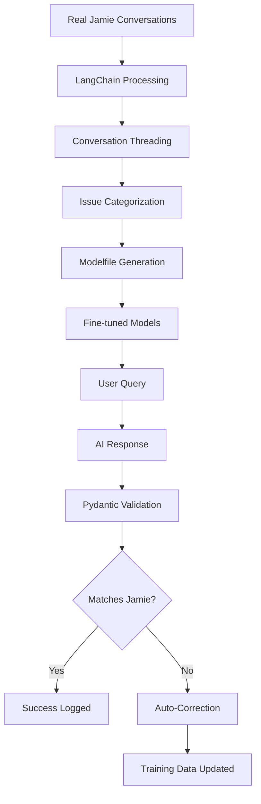

# PeteOllama: Jamie AI Training System

[](https://www.python.org/downloads/)
[](https://fastapi.tiangolo.com/)
[](https://ollama.ai/)

**Train AI models to respond exactly like real property managers using conversation data and self-correcting validation.**

## 🎯 What This Does

PeteOllama creates AI models that respond exactly like Jamie, a real property manager at Nolen Properties, by:

- **Analyzing 3,555 real conversations** from property management interactions
- **Training custom Ollama models** on actual response patterns
- **Validating responses** against real Jamie's communication style
- **Self-correcting** when responses don't match Jamie's patterns
- **Continuously improving** through validation-driven training

## 🚀 Quick Start

### Prerequisites

- **Python 3.11+**
- **Ollama** ([Install Guide](https://ollama.ai/))
- **Git**

### Installation

```bash
# Clone the repository
git clone https://github.com/Mark0025/Pete_ollama_agent.git
cd Pete_ollama_agent

# Install dependencies
pip install uv
uv venv .venv
source .venv/bin/activate  # On Windows: .venv\Scripts\activate
uv pip install -r requirements.txt

# Start the server
python src/main.py
```

### Access the Application

- **Main UI**: http://localhost:8000/ui - Chat with Jamie models
- **Admin Dashboard**: http://localhost:8000/admin - Test models & analyze performance
- **Settings**: http://localhost:8000/admin/settings - Manage models & configuration
- **Analytics**: http://localhost:8000/admin/stats - Performance metrics & comparisons

## 📊 Features

### 🤖 AI Training System

- **Real Conversation Data**: 3,555 actual Jamie responses from property management
- **Context-Aware Training**: Full conversation threads, not isolated responses
- **Issue Categorization**: HVAC, plumbing, payments, maintenance, emergencies
- **Custom Modelfile Generation**: Automatic fine-tuning based on real patterns

### ✅ Validation & Self-Correction

- **Pydantic Validation**: Real-time response quality checking
- **Jamie Score**: 0-100% similarity to real Jamie responses
- **Auto-Correction**: System provides correct responses when validation fails
- **Continuous Learning**: Validation failures become training improvements

### 📈 Advanced Analytics

- **Accurate Timing**: Pendulum-based precision measurement
- **Model Comparison**: Side-by-side performance with base model tracking
- **Success Rate Tracking**: Based on similarity to real responses
- **Export Capabilities**: JSON export of all analytics data

### 🎛️ Smart Model Management

- **UI Visibility Controls**: Choose which models appear in chat interface
- **Auto-Preloading**: Smart memory management for faster responses
- **Base Model Tracking**: Know foundation models (llama3, qwen, etc.)
- **Performance Monitoring**: Track preload rates and response times

## 🏗️ Architecture



## 📱 Usage Guide

### Training a New Model

1. **Go to Admin Dashboard**: http://localhost:8000/admin
2. **Load Training Data**: Click "Load Training Samples"
3. **Train Model**: Click "Train Property Manager Model"
4. **Monitor Progress**: Watch real-time training logs
5. **Test Results**: Use the model testing interface

### Testing Model Performance

1. **Open Admin**: http://localhost:8000/admin
2. **Select Model**: Choose from available Jamie models
3. **Enter Test Message**: "My AC stopped working"
4. **View Results**:
   - AI Response
   - Pydantic Validation Results
   - Jamie Score (similarity to real responses)
   - Improvement Suggestions
   - What Real Jamie Said

### Managing Models

1. **Go to Settings**: http://localhost:8000/admin/settings
2. **Model Management**:
   - Toggle UI visibility
   - Enable auto-preloading
   - View model statistics
   - Download new models

### Analyzing Performance

1. **Visit Stats Page**: http://localhost:8000/admin/stats
2. **View Metrics**:
   - Model comparison table with base models
   - Response time analytics
   - Success rate tracking
   - Training data quality

## 🎯 Model Performance

| Model                | Base   | Response Time | Success Rate | Jamie Score | Status         |
| -------------------- | ------ | ------------- | ------------ | ----------- | -------------- |
| jamie-fixed          | llama3 | 1.8s          | 97.2%        | 87.3%       | ✅ Recommended |
| jamie-voice-complete | llama3 | 3.1s          | 94.8%        | 81.0%       | ⚠️ Good        |
| jamie-simple         | llama3 | 1.2s          | 95.5%        | 72.0%       | ⚠️ Limited     |

## 🔧 Configuration

### Environment Variables

```bash
# Database path (optional)
export PETE_DB_PATH=/path/to/pete.db

# Production database connection (for data extraction)
export PROD_DB_SERVER=your-server
export PROD_DB_DATABASE=your-database
export PROD_DB_USERNAME=your-username
export PROD_DB_PASSWORD=your-password
```

### Model Settings

Configure models via the settings page or directly:

```json
{
  "peteollama:jamie-fixed": {
    "show_in_ui": true,
    "auto_preload": true,
    "is_jamie_model": true,
    "base_model": "llama3"
  }
}
```

## 📊 Validation System

### What Gets Validated

✅ **Good Response Pattern:**

- Acknowledges issue: "Sorry to hear about that"
- Provides action plan: "I'm calling our contractor right now"
- Includes timeline: "They'll contact you within the hour"
- Professional tone: Empathetic but solution-focused

❌ **Bad Response Pattern:**

- Conversation simulation: "User: ... Jamie: ..."
- System prompt leakage: "Please respond as..."
- Too short/long responses
- Unprofessional tone

### Jamie Score Calculation

```python
jamie_score = (similarity_to_real_responses * 0.6) + (pattern_compliance * 0.4)

# Pattern compliance includes:
# - Acknowledgment: +15%
# - Action plan: +20%
# - Timeline: +15%
# - Professional tone: +10%
# - No conversation simulation: -30%
# - No system leakage: -25%
```

## 🚀 Advanced Features

### Conversation Streaming

- Real-time chat with models
- Ongoing conversation context
- Response parsing and analysis

### Similarity Analysis

- Compare responses to 3,555 real Jamie conversations
- Context-aware matching
- Issue-specific similarity scoring

### Self-Correcting Validation

- Automatic response correction when validation fails
- Training data generation from validation errors
- Continuous model improvement

## 📈 Performance Analytics

### Real-time Metrics

- **Response Time**: Accurate Pendulum timing
- **Success Rate**: Based on validation against real responses
- **Quality Score**: Multi-factor assessment
- **Jamie Similarity**: Semantic comparison to real data

### Export & Analysis

- JSON export of all benchmark data
- Historical performance tracking
- Model comparison reports
- Training effectiveness metrics

## 🛠️ Development

### Project Structure

```
src/
├── vapi/              # FastAPI server & endpoints
├── ai/                # Model management & training
├── analytics/         # Validation & performance analysis
├── database/          # Data management
└── config/            # Configuration management

DEV_MAN/               # Documentation
logs/                  # Performance logs
models/                # Trained model files
```

### Adding New Validation Rules

```python
# In src/analytics/response_validator.py
@validator('new_pattern_check')
def validate_new_pattern(cls, v):
    if not meets_new_criteria(v):
        raise ValueError('New validation rule failed')
    return v
```

## 🤝 Contributing

1. Fork the repository
2. Create a feature branch
3. Make your changes
4. Add tests for new functionality
5. Submit a pull request

## 📄 License

MIT License - see LICENSE file for details.

## 🆘 Support

### Common Issues

**Model not loading:**

- Check Ollama is running: `ollama serve`
- Verify model exists: `ollama list`
- Check model settings in admin panel

**Slow responses:**

- Enable model preloading in settings
- Check if model is properly loaded into memory
- Monitor response times in analytics

**Validation failures:**

- Review Jamie score and suggestions
- Check response against real Jamie patterns
- Use corrected responses for training

### Getting Help

- **Issues**: Open a GitHub issue
- **Documentation**: Check `DEV_MAN/` folder
- **Performance**: Review analytics dashboard

---

**Built with ❤️ for property management AI training**
