# PeteOllama Architecture Analysis

## CURRENT PROBLEM (What We Broke)

## DESIRED SOLUTION (What We Need To Fix)

```mermaid
graph TB
    subgraph "✅ DESIRED (Fixed Architecture)"
        UI2["/ui - Frontend Chat Interface"]
        ADMIN2["/admin - Management Dashboard"]
        WEBHOOK2["/vapi/webhook - Voice Interface"]
        
        subgraph "Unified Backend"
            SERVER2["VAPIWebhookServer (webhook_server.py)"]
            SERVERLESS2["Serverless Handler Integration"]
        end
        
        RUNPOD2["RunPod Serverless Endpoint<br/>vk7efas3wu5vd7"]
        
        UI2 --> SERVER2
        ADMIN2 --> SERVER2
        WEBHOOK2 --> SERVER2
        SERVER2 --> SERVERLESS2
        SERVERLESS2 --> RUNPOD2
    end
    
    style UI2 fill:#ccffcc
    style ADMIN2 fill:#ccffcc
    style WEBHOOK2 fill:#ccffcc
    style SERVER2 fill:#ccffcc
    style RUNPOD2 fill:#ccffcc
```

## THE SIMPLE FIX

**Instead of eliminating your UI, we need to:**

1. **Keep your existing `VAPIWebhookServer`** with `/ui` and `/admin` 
2. **Route its model calls through RunPod** instead of local Ollama
3. **Use our working `runpod_handler.py`** as the backend

```mermaid
sequenceDiagram
    participant User as 👤 User
    participant UI as 🌐 /ui Interface  
    participant Server as 🔧 VAPIWebhookServer
    participant Handler as 🚀 RunPod Handler
    participant RunPod as ☁️ RunPod Endpoint

    User->>UI: "My AC stopped working"
    UI->>Server: POST /test/stream
    Server->>Handler: chat_completion(message)
    Handler->>RunPod: {"prompt": "My AC stopped working"}
    RunPod->>Handler: AI Response
    Handler->>Server: Formatted Response
    Server->>UI: Streaming Response
    UI->>User: Jamie's helpful answer
```

